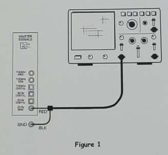
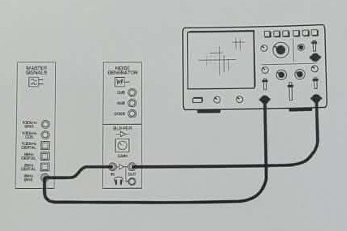
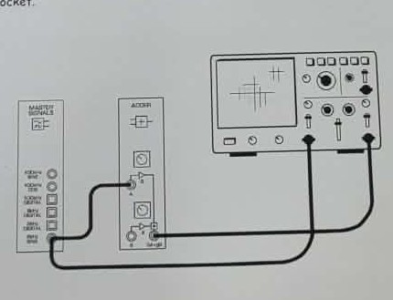
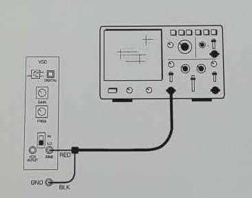
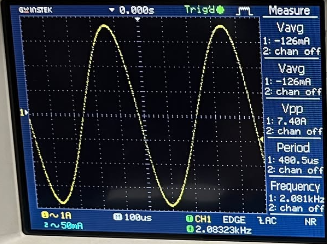
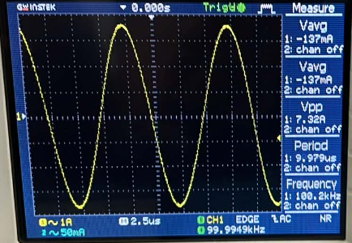
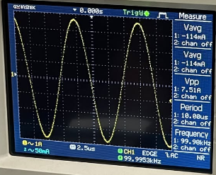

## EXPERIMENT NO. 2 : An Introduction to the Telecoms-Trainer 101

---

## INTRODUCTION
The Emona Telecoms-Trainer 101 is a modular training platform used to study the basic building blocks of analog communication systems through **block diagrams** and hands-on measurements. In real communication systems, signals are generated, amplified, added, phase-shifted, and controlled in frequency depending on the application.

---

## OBJECTIVE
1. Familiarize with the Telecoms-Trainer 101 analog modules and their functions.
2. Measure and compare **amplitude (Vpp)** and **frequency** of Master Signals outputs.
3. Measure the **phase difference** between sine and cosine signals using an oscilloscope method.
4. Investigate how the **Adder** module gain controls affect output amplitude.
5. Observe how the **Phase Shifter** changes phase and whether it can lead/lag the input.
6. Demonstrate the **Buffer** module as an amplifier/driver for different signal sources.
7. Study the **VCO** frequency behavior and how it changes with **control voltage (Variable DCV)**.

---

## MATERIALS
- Emona Telecoms-Trainer 101 (with power pack)
- Dual-channel oscilloscope (≥ 20 MHz)
- Two oscilloscope probes/leads (Ch.1 and Ch.2)
- Patch leads (banana/patch cords)
- Headphones (stereo)

---

## PROCEDURE AND CIRCUIT SETUPS

### Part 2.1 — Master Signals and Speech Module
**Setup:** Connect the 2 kHz SINE output to Ch1 to measure basic parameters. For the Speech section, the microphone output is patched directly to the oscilloscope.

1. **Master Signals:** Measured Vpp, Period, and Frequency for 2 kHz SINE, 100 kHz SINE, and 100 kHz COS.
2. **Speech Module:** Spoke into the microphone and observed non-periodic waveforms.

### Part 2.2 — Buffer Module
**Setup:** The output of a signal source (Master Signals or Speech) is patched to the Buffer Input. The headphones are connected to the Buffer Output.

1. Connected the 2 kHz SINE and Speech signals to the Buffer.
2. Adjusted Buffer Gain and verified audibility through headphones.

### Part 2.3 — Adder and Phase Shifter Module
**Setup:** Two signals (Ch1 and Ch2) are patched into the Adder inputs. For Phase shifting, the 2 kHz SINE is passed through the Phase Shifter module before reaching the scope.

1. **Adder Gain:** Connected 2 kHz SINE to Input A. Measured max/min gain by varying the G control.
2. **Phase Shifter:** Observed input vs. output while turning Phase Adjust and toggling the 0°/180° switch.

### Part 2.4 — VCO Module
**Setup:** The Variable DCV module provides a control voltage to the VCO input to manipulate the output frequency.

1. Measured VCO SINE output at HI and LO ranges.
2. Verified the relationship between control voltage and output frequency.

---

## RESULTS AND DISCUSSION

### Table 1 — Master Signals Measurements
| Signal Output | Vpp (V) | Period (s) | Frequency (Hz) |
|---|---:|---:|---:|
| 2 kHz SINE | 7.40 | 480.5 µs | 2.081 kHz |
| 100 kHz COS | 7.51 | 10.00 µs | 99.98 kHz |
| 100 kHz SINE | 7.32 | 9.97 µs | 100.2 kHz |

#### Waveform Gallery
| 2 kHz SINE | 100 kHz SINE | 100 kHz COS |
| :---: | :---: | :---: |
|  |  |  |

---

### Speech and Buffer Observations
- Speech waveforms were **non-periodic**.
- 2 kHz SINE and Speech were **audible**; 100 kHz SINE was **inaudible**.

---

### Phase Shifter Module
**Question:** Can it shift by 360°? 
**Answer:** It can approach a full cycle shift depending on the control and toggle settings.

#### Phase Shift Real-time Observation
<video src="./images/phase_shift_video.mp4" width="400" controls>
  Your browser does not support the video tag.
</video>

---

### VCO Module Questions
- **Clockwise VDC:** Output voltage increases, VCO frequency **increases**.
- **Anti-clockwise VDC:** Output voltage decreases, VCO frequency **decreases**.

#### VCO Frequency Range Observations
| HIGH MINIMUM | HIGH MAXIMUM |
| :---: | :---: |
|  |  |

| LOW MINIMUM | LOW MAXIMUM |
| :---: | :---: |
|  |  |

| ANTI-CLOCKWISE | CLOCKWISE |
| :---: | :---: |
|  |  |

---

## REFLECTION
This experiment demonstrated how communication systems are built using modular functional blocks. Observing signals on the oscilloscope made the concepts of amplitude, frequency, and phase difference tangible. I learned that while fixed oscillators provide stable references, the VCO allows for dynamic frequency control—a key principle for FM. Mastering these adjustments is essential for building complex modulation systems.
