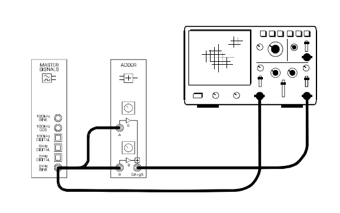
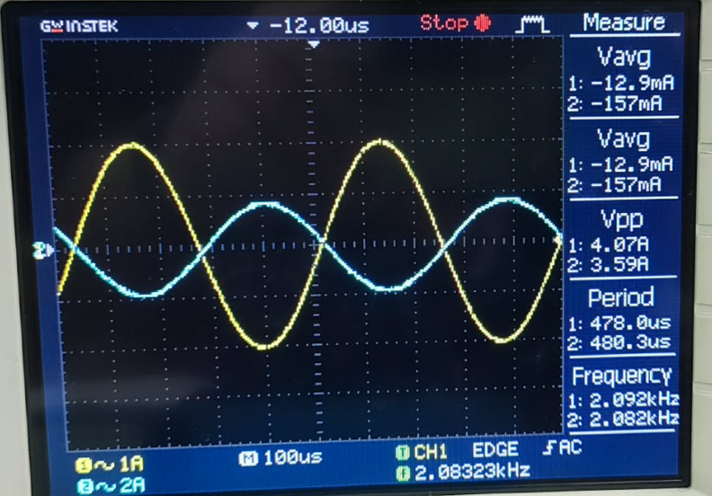
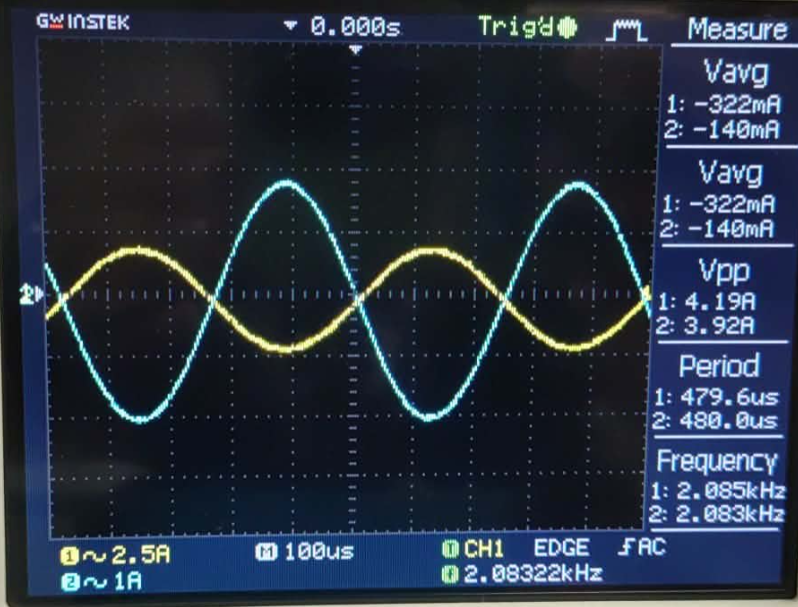
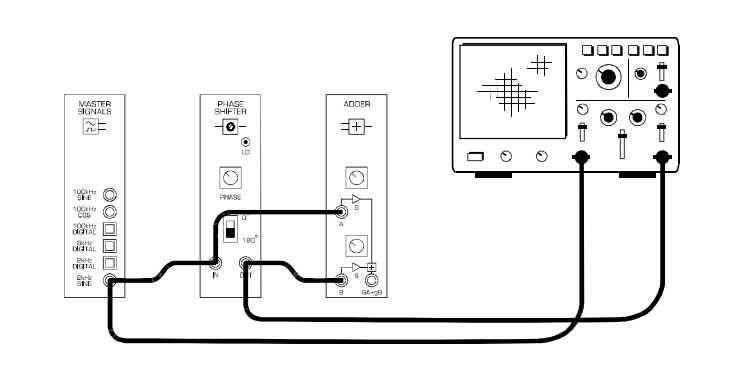
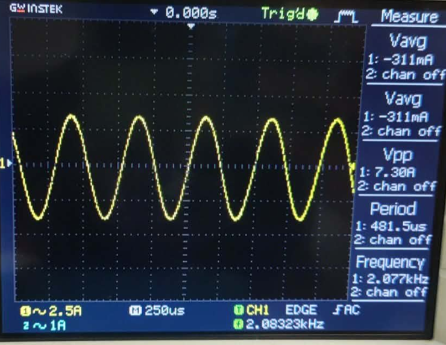
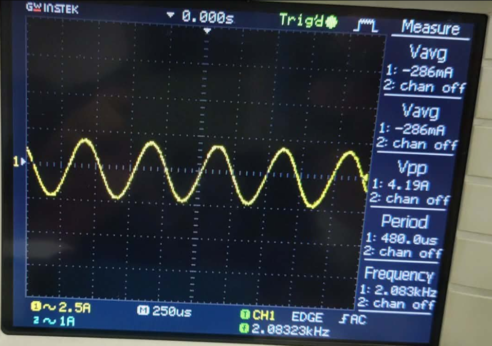

# Experiment 3 — Using the Telecoms-Trainer 101 to Model Equations  

---

## INTRODUCTION
In communications and electronics, many system behaviors can be represented using **mathematical equations**. The Emona **Telecoms-Trainer 101** makes these equations “visible” by letting us build signal-processing blocks (like adders and phase shifters) and then verify the results using an oscilloscope.

This experiment models two simple equations using a **2 kHz sine wave** from the Master Signals module:

1. **Addition of two identical signals** \[
   Vout = A + B
   \]
   If A and B are the same sine wave (same phase, same amplitude), the result should be **double the amplitude**.

2. **Addition with a 180° phase-shifted signal** \[
   Vout = A + B_{\left(180^\circ\right)}
   \]
   If two equal-amplitude sine waves are **180° out of phase**, they cancel and the output should ideally be **0 V (null output)**.

---

## OBJECTIVE
- To use the Telecoms-Trainer 101 to **model equations** using real electrical signals.
- To verify that adding two identical sine waves produces approximately **double amplitude**.
- To verify that adding two equal sine waves with **180° phase difference** produces approximately **zero output**.
- To explain why practical results may differ from theoretical predictions due to non-idealities.

---

## MATERIALS
- Emona **Telecoms-Trainer 101** (with power pack)
- **Dual-channel** oscilloscope (≈ 20 MHz or higher)
- Oscilloscope probes/leads (2 channels)
- Patch leads / connecting wires

---

## PROCEDURE AND CIRCUIT SETUPS

### A. Set up and Model: \( Vout = A + B \)
1. Power on the Telecoms-Trainer 101 and the oscilloscope.
2. Set up the oscilloscope: **Trigger Source**: CH1, **Mode**: CH1.
3. Locate the **Adder** module and set its **G** and **g** controls to the middle.

#### Adder Module Setup

4. Connect the 2kHz Sine to the Adder inputs.
5. Adjust **G** and **g** for unity gain (-1) for both inputs.

---

## RESULTS: ADDITION

#### Input Signal (2 kHz Sine)

#### Output Signal (A + B)

---

### B. Add Phase Shift and Model: \( Vout = A + B_{(180^\circ)} \)
18. Set the **Phase Shifter** module to **180°**.
19. Connect Signal A directly and Signal B through the Phase Shifter.

#### Setup for Phase Shifting

20. Adjust phase until CH1 and CH2 are perfectly inverted.

---

## RESULTS: PHASE CANCELLATION

---

## RESULTS AND DISCUSSION

#### Question 1  
**Is the Adder module’s measured output voltage exactly 8 Vp-p as theoretically predicted?** **Answer:** Not exactly. The measured output is usually **close** to 8 Vp-p but may be slightly higher or lower due to non-ideal gain settings and measurement tolerances.

#### Question 2  
**What are two reasons for this (why not exactly 8 Vp-p)?** 1. **Gain setting errors:** The Adder gains (G and g) may not be set to exactly 1.  
2. **Instrument tolerances:** Oscilloscope and probe accuracy limits.

---

#### Question 3  
**What are two reasons for the output not being 0 V as theoretically predicted (after 180° phase shift)?** 1. **Phase not exactly 180°:** Even a small phase error prevents perfect cancellation.  
2. **Amplitude mismatch:** If input A and B amplitudes are not exactly equal, a residual signal remains.

---

#### Question 5  
**What can be said about the phase shift between the signals on the Adder module’s two inputs now (after minimizing output using Phase Adjust)?** **Answer:** The phase shift is approximately **180°**, which produces the maximum level of destructive interference.

---

#### Question 6  
**What can be said about the gain of the Adder module’s two inputs now (after minimizing output using g control)?** **Answer:** The gains are adjusted to be **identical**, ensuring the amplitudes cancel each other out as completely as possible.

---

## REFLECTION
This experiment helped me understand how mathematical equations can be represented using real signal blocks on the Telecoms-Trainer 101. I observed that ideal results (exactly 8 Vp-p or exactly 0 Vp-p) are difficult to achieve because real circuits and instruments have limitations. Adjusting the **Phase Shifter** and **Adder gains** showed me that even small differences in phase or amplitude can strongly affect the output. Overall, the lab strengthened my understanding of **signal addition, phase relationships, and practical sources of error** in communication systems.
