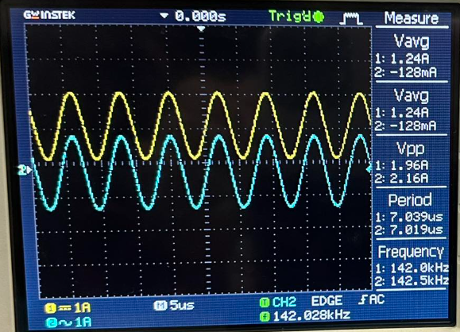
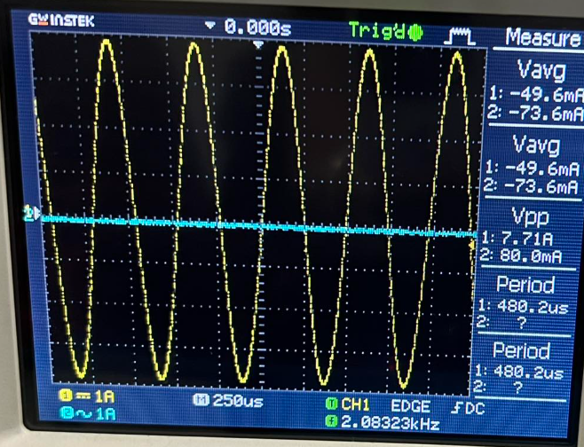
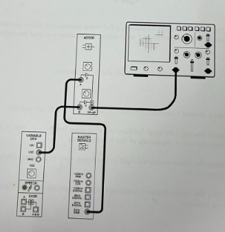
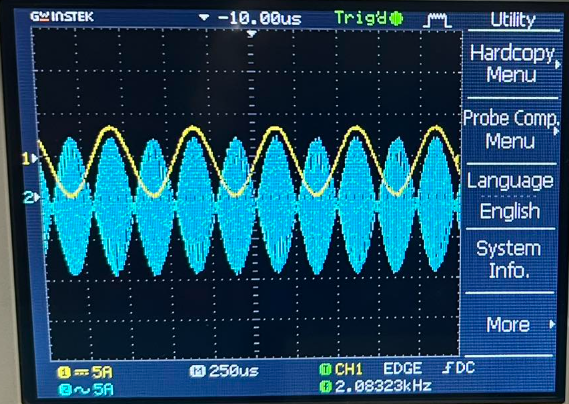
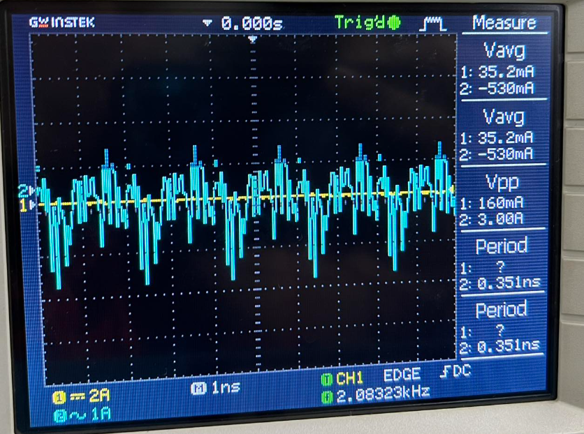
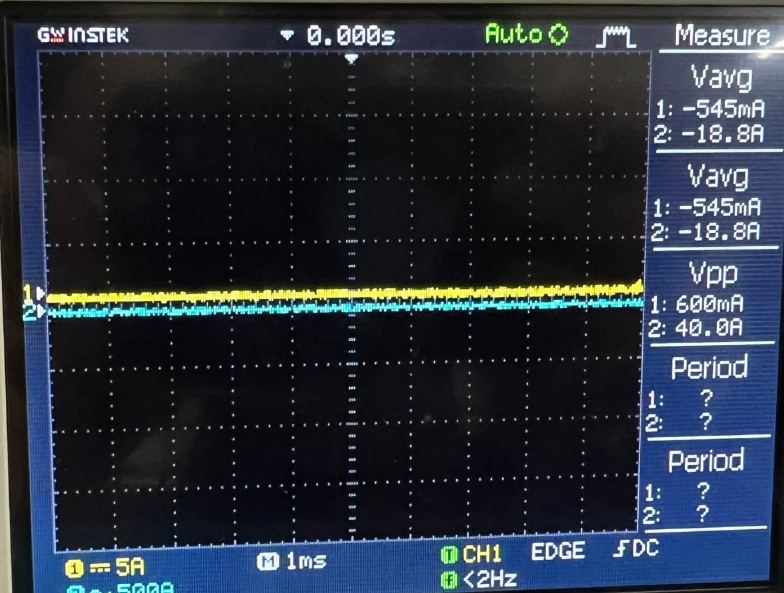

# Experiment 4: Exploring Amplitude Modulation (AM)

---

## INTRODUCTION
Amplitude Modulation (AM) represents a foundational pillar in electronic communication, enabling the wireless transmission of data over vast distances. The process works by adjusting the intensity (amplitude) of a high-frequency **carrier wave** in direct response to the instantaneous voltage levels of a lower-frequency **information signal** (the message).

This laboratory exercise utilizes the Emona Telecoms-Trainer 101 to physically implement the standard AM mathematical model:
\[
V_{AM}(t) = [V_{DC} + v_{m}(t)] \cdot \cos(2\pi f_{c}t)
\]
By combining a DC offset with a message signal and feeding them into a multiplier alongside a carrier, we can analyze the resulting wave's structure, identify its envelope, and observe the critical threshold of modulation depth.

---

## OBJECTIVES
- To investigate the underlying physics of signal encoding via amplitude variation.
- To synthesize a functional AM wave using a standard sinusoidal message.
- To identify and analyze the **signal envelope** as the primary carrier of information.
- To quantify the relationship between signal intensity and the **modulation index ($m$)**.
- To diagnose the visual and technical consequences of **over-modulation**.

---

## MATERIALS
- **Emona Telecoms-Trainer 101** system
- **Oscilloscope** (Dual-trace, $\geq$ 20 MHz)
- **Master Signals:** Providing the 2 kHz message and 100 kHz carrier.
- **Adder & Variable DC:** Used to prepare the message with the necessary DC bias.
- **Multiplier:** The core component that mixes the signals to create the AM wave.
- **Speech Module:** To test the system using real-world dynamic audio.

---

## PROCEDURE

### Part A – Generating an AM Signal Using a Sinewave Message

1. Initialize the oscilloscope with Channel 1 set to DC coupling.
2. Mix the **2 kHz sine wave** (Message) with the **Variable DC** output using the Adder module.

3. Calibrate the Adder to produce a **1 V DC baseline** with a **1 Vp-p sine wave** superimposed upon it.
4. Route this combined "DC + Message" signal to the **Multiplier's X-input**.
5. Connect the **100 kHz carrier** to the **Multiplier's Y-input**.
6. Align the oscilloscope traces to visualize the interaction between the raw message and the modulated output.
   

#### Question 1: In what way is the Adder module’s output now different to the signal out of the Master Signals module’s 2 kHz SINE output?
**Answer:** While the original sine wave is symmetrical around 0 V, the Adder’s output is shifted entirely into the positive voltage range. It becomes a message signal "floating" on a steady DC baseline, which is essential for ensuring the carrier never disappears during the modulation process.

7. Finalize the hardware model to represent the full equation.

8. Examine the resulting waveform on the scope.

#### Question 2: What feature of the Multiplier module’s output suggests that it’s an AM signal?
**Answer:** The **envelope**. The peak-to-peak amplitude of the high-frequency carrier rises and falls in perfect synchronization with the 2 kHz message wave.

#### Question 3: The AM signal is a complex waveform consisting of more than one signal. Is one of the signals a 2 kHz sinewave? Explain your answer.
**Answer:** No. Even though the *shape* is visible, the output is actually a combination of high-frequency components (the carrier and sidebands). The 2 kHz message is encoded in the amplitude variations, not transmitted as a separate frequency component.

#### Question 4: For the given inputs to the Multiplier module, how many sinewaves does the AM signal consist of, and what are their frequencies?
**Answer:** The signal is composed of:
- **Carrier:** $f_c = 100\text{ kHz}$
- **Upper Sideband (USB):** $f_c + f_m = 102\text{ kHz}$
- **Lower Sideband (LSB):** $f_c - f_m = 98\text{ kHz}$

---

### Part B – Generating an AM Signal Using Speech

1. Replace the periodic sine wave with the **Speech Module**.
2. Speak into the microphone and observe the oscilloscope.
3. Note how the carrier peaks now mirror the irregular and complex patterns of human speech.

<video src="https://github.com/user-attachments/assets/2f03dbe0-506e-4f92-8b2d-6c9e66d0994b" width="400" controls></video>

#### Question 5: Why is there still a signal out of the Multiplier module even when you’re not talking, whistling, etc?
**Answer:** This is due to the **constant DC component**. Even without an audio signal, the multiplier processes the 1 V DC against the carrier, resulting in a steady, unmodulated carrier wave at the output.

---

### Part C – Investigating Depth of Modulation

1. Manipulate the Adder's gain to observe fluctuations in modulation intensity.
2. Determine the modulation index ($m$) by measuring the envelope peak ($P$) and trough ($Q$): $m = (P - Q)/(P + Q)$.

#### Minimum Modulation

#### Maximum Modulation (Over-modulation)

#### Question 6: What is the relationship between the message's amplitude and the amount of the carrier's modulation?
**Answer:** They are directly proportional. Increasing the message amplitude causes the carrier’s envelope to vary more drastically, thereby increasing the modulation index.

#### Question 7: What is the problem with the AM signal when it is over-modulated?
**Answer:** The envelope "clips" or crosses over itself as the carrier amplitude attempts to go below zero. This creates phase reversals and distortion that a standard receiver cannot resolve, resulting in garbled audio.

#### Question 8: What do you think is a carrier’s maximum modulation index without over-modulation?
**Answer:** $m = 1.0$ (or 100% modulation).

---

## RESULTS AND DISCUSSION
The experiment successfully validated the hardware modeling of Amplitude Modulation. Our observations confirmed that:
- The carrier serves as a high-frequency "transport" for the lower-frequency information.
- AM signals are mathematically complex, consisting of the carrier plus two distinct sidebands.
- A steady DC offset is vital for standard AM to ensure a continuous carrier reference.
- **Signal Integrity:** Maintaining a modulation index where $m \leq 1$ is critical; exceeding this limit results in "envelope crossover," which destroys the quality of the recovered information.

---

## REFLECTION
Building this AM circuit provided a tangible bridge between abstract communication equations and physical signal behavior. Witnessing real-time speech patterns transform a 100 kHz carrier's amplitude clarified how radio transmission works in the real world. The most significant takeaway was learning to balance the DC bias and message gain—a delicate act required to maximize signal strength without inducing the destructive distortion of over-modulation.
